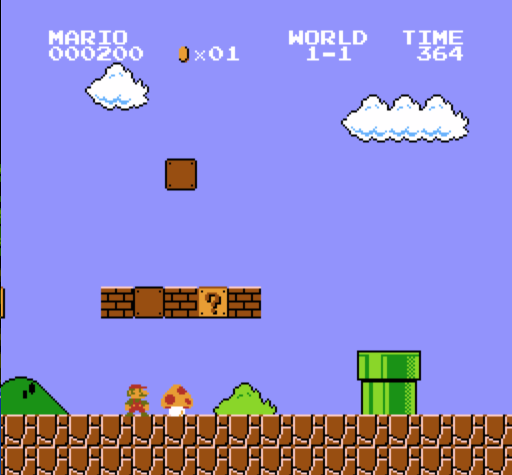
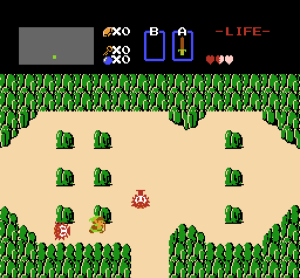
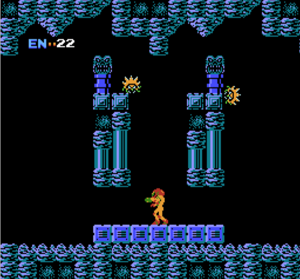
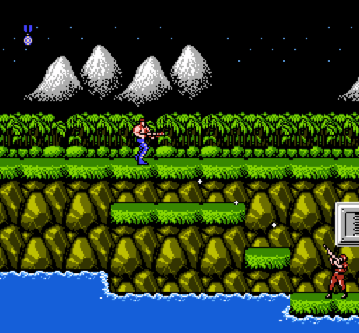

# RustedNES

## Description

RustedNES is a Nintendo Entertainment System emulator written in the Rust programming language. It runs on Windows, MacOS, and Linux. It currently supports many commercial games.

## Screenshots






## Building

To build RustedNES you will need to have have Rust installed. You can find instructions here https://www.rust-lang.org/en-US/install.html

For the SDL frontend you will also need SDL2 installed. For Ubuntu that can be done like this:

```
sudo apt install libsdl2-dev
```

Then run the following in the project directory to build:

```
cargo build --release
```

Note: the release flag may be necessary to get playable speed.

## Running

There are currently 2 different ways to run RustedNES. There is a simple SDL frontend, and a libretro core that can be used with RetroArch or other libretro frontends.

### SDL

The SDL interface is simple to use, but it's not configurable. To run with more features, see [libretro](#libretro) below.

The built executable can be found in the `target/release` directory. The file is named `rustednes-sdl` (with .exe extension on Windows).

To play a game, simply pass the ROM file as an argument.

```
$ rustednes-sdl --help
An SDL2 frontend for rustednes-core

Usage: rustednes-sdl [OPTIONS] <ROM>

Arguments:
  <ROM>  The name of the ROM to load

Options:
  -d, --debug       Start in debug mode
      --noaudio     Disable audio
  -v, --verbose...  More output per occurrence
  -q, --quiet...    Less output per occurrence
  -h, --help        Print help information
  -V, --version     Print version information
```

Here are the keyboard controls:

| Button | Key |
| --- | --- |
| Left | <kbd>left</kbd> |
| Right | <kbd>right</kbd> |
| Up | <kbd>up</kbd> |
| Down | <kbd>down</kbd> |
| Select | <kbd>space</kbd> |
| Start | <kbd>enter/return</kbd> |
| A | <kbd>X</kbd> |
| B | <kbd>Z</kbd> |

### libretro

Using RustedNES with a libretro frontend, such as RetroArch, allows many additional features, such as:

* Save states
* SRAM saving
* Changing window size / fullscreen
* Gamepads and other input devices
* Configurable buttons
* Cheats

To run on RetroArch you will need to find the shared library of the libretro core that was created in the build step. You can find it in the `target/release` directory. The name of the file will be different depending on the platform:

* `rustednes_libretro.dll` on Windows
* `librustednes_libretro.dylib` on MacOS
* `librustednes_libretro.so` on Linux

You need to pass that file as an argument after -L, as in the following example for MacOS:

```
retroarch -L librustednes_libretro.dylib name_of_rom.nes
```

## License

Duel-license under MIT license ([LICENSE-MIT](LICENSE-MIT)), or Apache License, Version 2.0 ([LICENSE-APACHE](LICENSE-APACHE))

## Special Thanks

Thanks to the people who created the following emulator projects, which were used for ideas and inspiration for this project:

* https://github.com/emu-rs/rustual-boy (Virtual Boy emulator written in Rust)
* https://github.com/pcwalton/sprocketnes (NES emulator written in Rust)
* https://github.com/fogleman/nes (NES emulator written in Go)

Also thanks to nesdev.com for all of the awesome resources on their wiki: http://wiki.nesdev.com/w/index.php/Nesdev_Wiki
